# 🛡️ Privileged Identity Management (PIM) — Just-In-Time Access Control

**Platform:** Microsoft Entra ID (Azure AD)  
**Organization:** @tenantname  
**Author:** Kingsley  
**Date:** May 23, 2026  

---

## ⚠️ The Problem This Lab Addresses

In most organizations, administrators are assigned privileged roles — such as Global Administrator — **permanently**. This means their accounts carry full admin power 24 hours a day, 7 days a week, even when they are not actively performing administrative tasks. This is known as **standing privilege**, and it is one of the most dangerous security gaps in identity management.

The risks of standing privilege are severe:

- If a permanent admin account is compromised through phishing, credential theft, or insider threat, the attacker immediately gains full control of the entire tenant with no time limit
- Privileged accounts are the highest-value targets for attackers — permanent standing access makes them a permanent target
- Compliance frameworks including **NIST 800-53**, **ISO 27001**, and **CIS Controls** explicitly require least-privilege access and time-bound elevated permissions
- Microsoft reports that **most high-impact breaches begin with a privileged account compromise**, and standing privilege dramatically increases blast radius

**Privileged Identity Management (PIM)** solves this by replacing permanent admin assignments with **Just-In-Time (JIT) access** — users are made *eligible* for a privileged role but must actively request activation, provide a justification, pass MFA, and receive approval from a designated approver before the role is granted. Access is time-limited and automatically expires, ensuring no one holds standing privilege unnecessarily.

---

## 📋 Overview

In this lab, I configured **Privileged Identity Management (PIM)** in Microsoft Entra ID to implement Just-In-Time access control for the **Global Administrator** role. The lab covers five phases:

1. **PIM Setup & Navigation** — Exploring the PIM interface and understanding the existing role state
2. **Role Settings Configuration** — Defining activation rules, expiry policies, MFA requirements, approval workflows, and notification settings
3. **Eligible Assignment Creation** — Assigning users as eligible (not permanent) for the Global Administrator role with time-bound windows
4. **End-User Activation & Admin Approval** — Signing in as a test user, requesting role activation with justification, and approving the request as admin
5. **Verification & Audit** — Confirming the role is active, reviewing the full audit trail, and examining PIM security alerts

---

## 🗂️ Table of Contents

- [The Problem This Lab Addresses](#️-the-problem-this-lab-addresses)
- [Phase 1 — PIM Setup & Navigation](#phase-1--pim-setup--navigation)
- [Phase 2 — Role Settings Configuration](#phase-2--role-settings-configuration)
- [Phase 3 — Eligible Assignment Creation](#phase-3--eligible-assignment-creation)
- [Phase 4 — End-User Activation & Admin Approval](#phase-4--end-user-activation--admin-approval)
- [Phase 5 — Verification & Audit](#phase-5--verification--audit)
- [Summary](#summary)
- [Skills Demonstrated](#-skills-demonstrated)
- [Career Relevance](#-career-relevance)
- [Related Labs](#-related-labs-in-this-repository)

---

## Phase 1 — PIM Setup & Navigation

### Step 1 — Navigated to the PIM Quick Start Page

I opened the **Microsoft Entra Admin Center** and navigated to **ID Governance > Privileged Identity Management**. The Quick Start page presented the three core pillars of PIM: **Manage access** (least-privilege enforcement), **Activate just in time** (eliminating persistent access), and **Discover and monitor** (visibility into who holds privileged roles). This was my entry point for the entire lab.

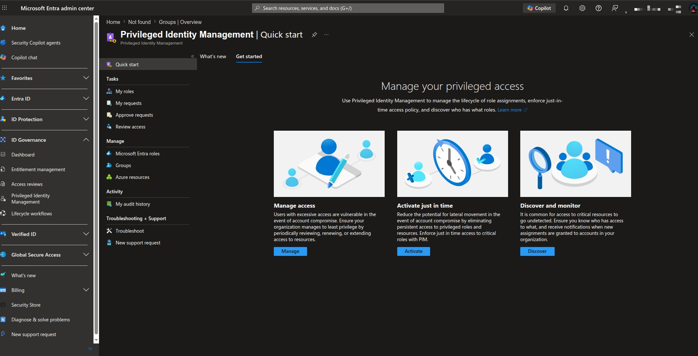

---

### Step 2 — Opened Microsoft Entra Roles in PIM

I clicked on **Microsoft Entra roles** under the Manage section to enter the PIM role management interface. This view presented the four key PIM workflows: **Assign Eligibility**, **Activate your role**, **Approve requests**, and **View your history** — covering the complete JIT access lifecycle from assignment through to audit.

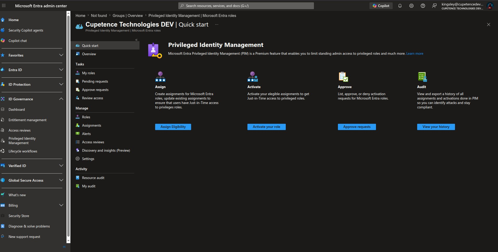

---

### Step 3 — Browsed the Full Roles List

I navigated to **Roles** under the Manage section to view all available Microsoft Entra roles eligible for PIM management. The list showed all directory roles including **Global Administrator** (10 current active assignments), **Helpdesk Administrator** (210), **Global Reader** (231), and many others. This gave me a full picture of the privileged role landscape before making any changes.

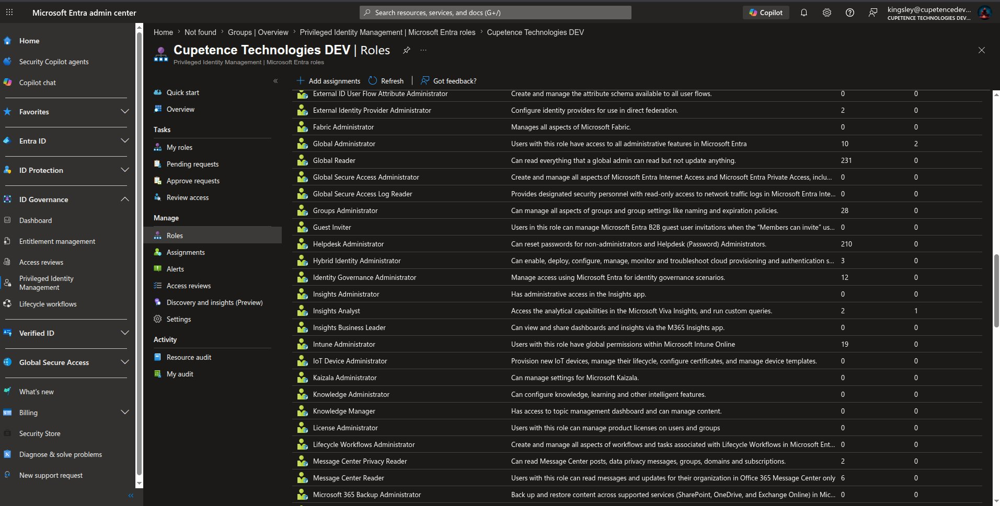

---

### Step 4 — Viewed Existing Global Admin Eligible Assignments

I clicked on **Global Administrator** and navigated to **Assignments > Eligible assignments**. I could see 2 existing eligible assignments — both group-based (PAG - Senior Leadership and PAG - Enterprise Information) — assigned as Permanent. This confirmed the existing state before I began configuring additional assignments.

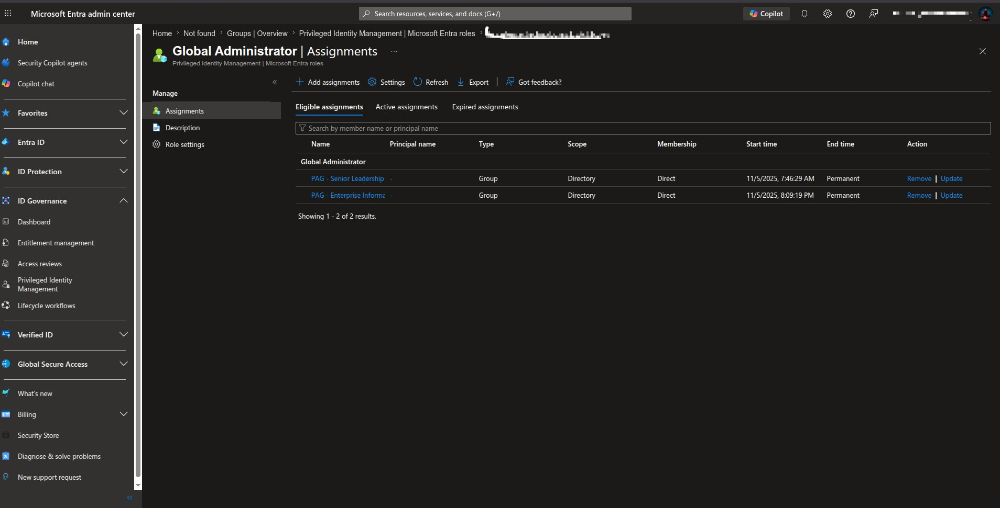

---

## Phase 2 — Role Settings Configuration

### Step 5 — Configured Activation Settings for Global Administrator

I clicked **Settings** and opened the **Edit role setting — Global Administrator** page on the **Activation** tab. I configured the following controls to enforce secure JIT access:

| Setting | Value |
|---|---|
| Activation maximum duration | **2 hours** |
| On activation, require | **Azure MFA** |
| Require justification on activation | ✅ Enabled |
| Require approval to activate | ✅ Enabled |
| Selected approvers | 6 members configured |

This meant any user requesting Global Admin access would need to complete MFA, provide a written justification, and wait for one of the designated approvers to grant the request — with access automatically expiring after 2 hours.

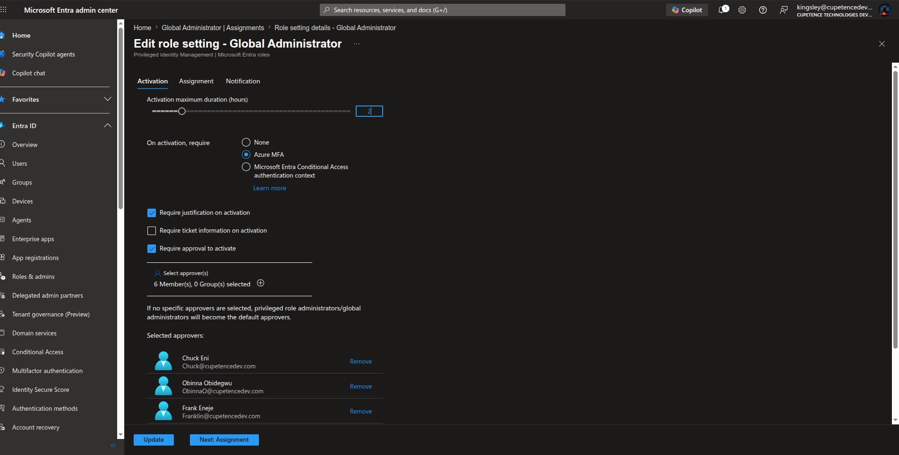

---

### Step 6 — Configured Assignment Expiry Rules

Still in the role settings, I moved to the **Assignment** tab and configured the following expiry rules to prevent stale assignments:

| Setting | Value |
|---|---|
| Allow permanent eligible assignment | ❌ Disabled |
| Expire eligible assignments after | **15 Days** |
| Allow permanent active assignment | ❌ Disabled |
| Expire active assignments after | **6 Months** |
| Require Azure MFA on active assignment | ✅ Enabled |
| Require justification on active assignment | ✅ Enabled |

Disabling permanent assignments meant no user could hold the Global Administrator role (active or eligible) indefinitely — all assignments would automatically expire, enforcing continuous review.

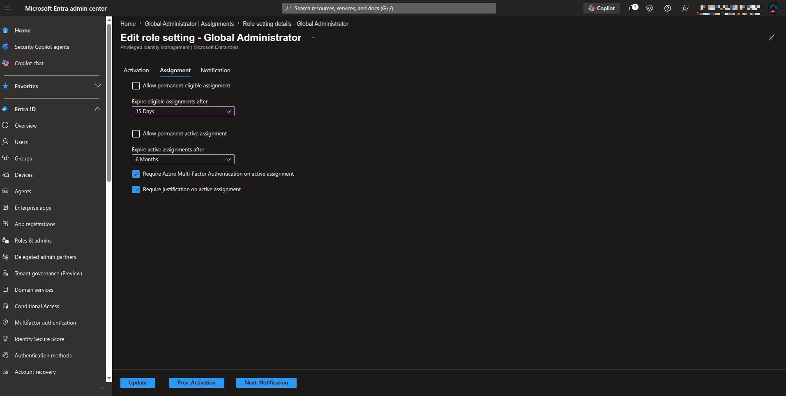

---

### Step 7 — Reviewed Notification Settings

I navigated to the **Notification** tab to review the email alert configuration. PIM was set to send notifications across three trigger events: when members are assigned as eligible, when members are assigned as active, and when eligible members activate the role. Notifications were configured to alert the Assignee/Requestor and Approver by default, ensuring full visibility of all role activity across all relevant stakeholders.

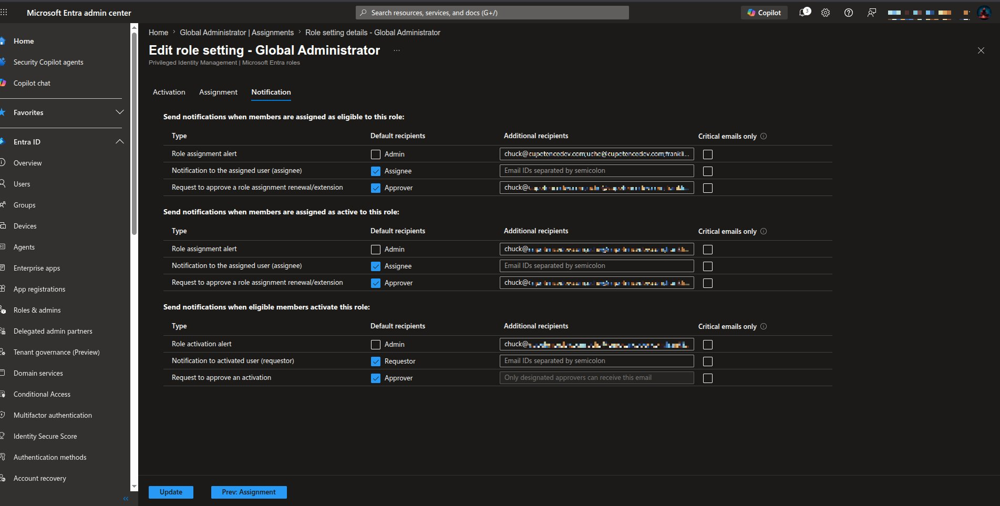

---

## Phase 3 — Eligible Assignment Creation

### Step 8 — Searched for Member to Assign

I clicked **+ Add assignments** and searched for `KATE` in the member search panel. The search returned 1 result — **kate ALL** (`Kateall@tenantname`) — who was the same test user from the MFA Conditional Access lab. I selected her as the eligible assignee and clicked **Select**.

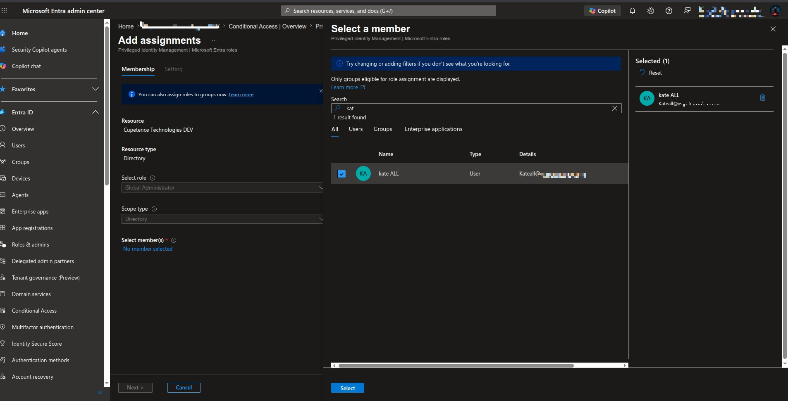

---

### Step 9 — Confirmed Member Selection

The Membership tab confirmed **kate ALL** as the selected member for the Global Administrator eligible assignment. I clicked **Next** to proceed to the Setting tab.

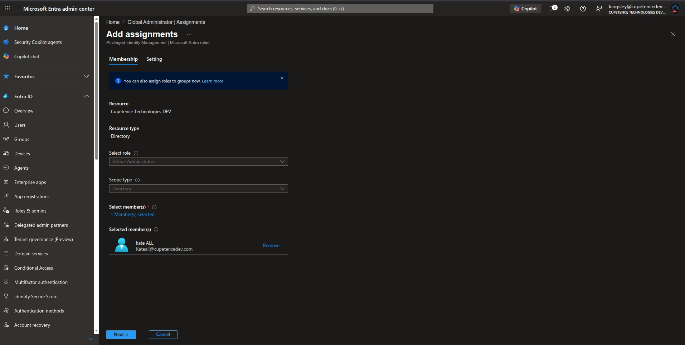

---

### Step 10 — Set Time-Bound Eligible Assignment

On the **Setting** tab, I configured a time-bound eligible assignment for kate ALL:

| Setting | Value |
|---|---|
| Assignment type | **Eligible** |
| Permanently eligible | ❌ Unchecked |
| Assignment starts | 05/23/2026, 10:05:17 PM |
| Assignment ends | 08/23/2026, 9:05:17 PM |

I clicked **Assign** to complete the assignment.

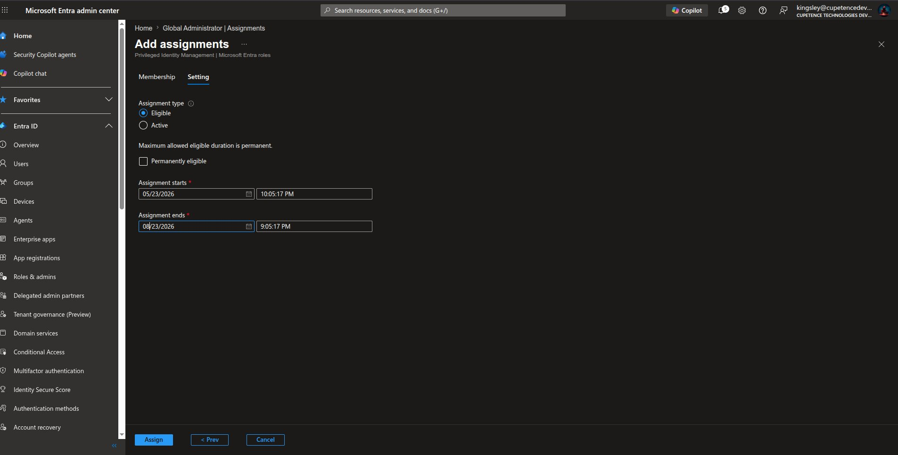

---

### Step 11 — Verified Final Eligible Assignments

The **Global Administrator Assignments** dashboard now showed **3 eligible assignments** in total:

| Name | Type | Start time | End time |
|---|---|---|---|
| PAG - Senior Leadership | Group | 11/5/2025 | Permanent |
| kate ALL | User | 5/23/2026, 10:08 PM | 8/23/2026, 9:05 PM |
| PAG - Enterprise Information | Group | 11/5/2025 | Permanent |

Kate ALL's time-bound eligible assignment was confirmed and active. Phase 3 was complete.

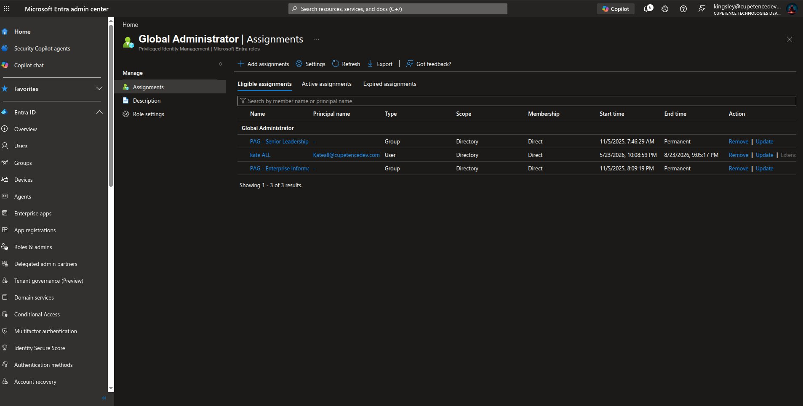

---

## Phase 4 — End-User Activation & Admin Approval

### Step 12 — Signed In as the Test User

I opened a new browser session and navigated to the Microsoft sign-in page. The **Pick an account** screen appeared with `Kateall@tenantname` as a cached account. I selected it to sign in as the test user and verify the JIT activation flow from the end-user perspective.

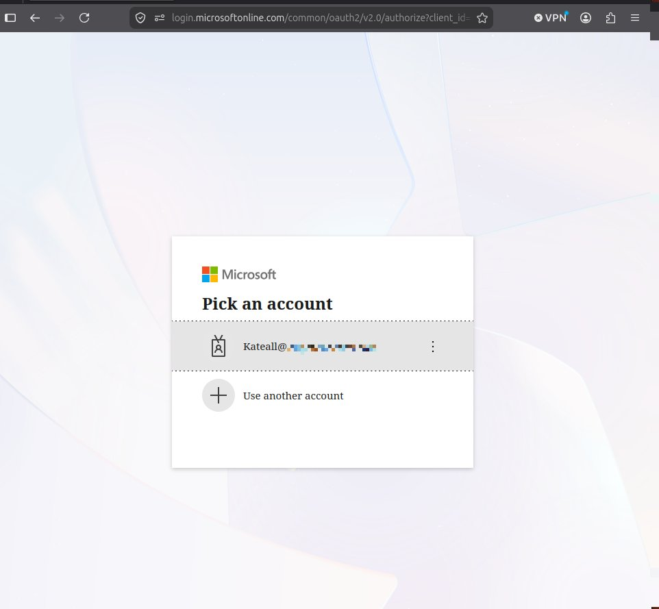

---

### Step 13 — Completed MFA Sign-In

The sign-in flow triggered an **Approve sign in request** challenge, displaying the number **22**. I opened the Microsoft Authenticator app on the mobile device and entered the number to approve the request, confirming the MFA requirement was working correctly for the test user account.

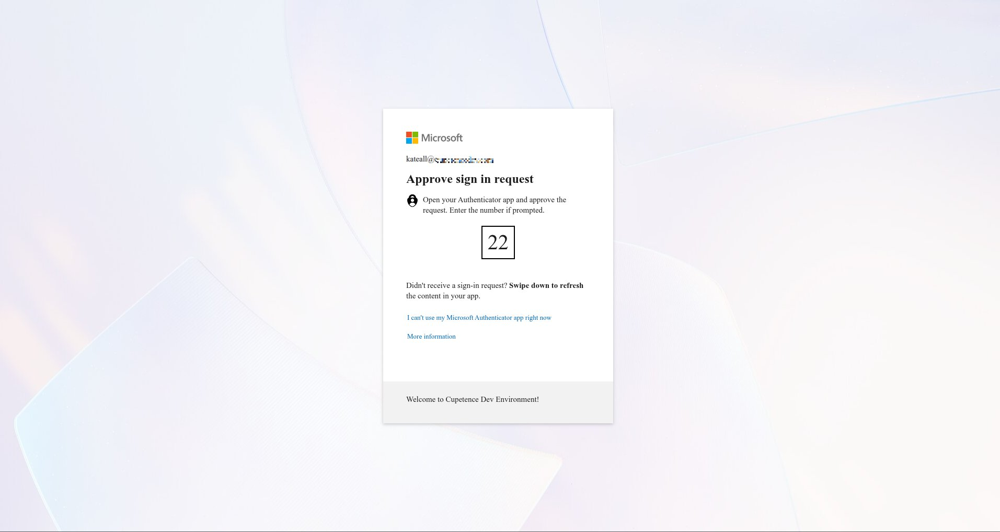

---

### Step 14 — Confirmed Test User Has No Active Roles

After signing in as kate ALL, I arrived at the **Microsoft Entra home** dashboard. The profile panel confirmed **kate ALL — No roles assigned**, verifying that the eligible assignment alone does not grant access — the user must explicitly request and receive approval for role activation. The tenant showed Entra ID Premium P2 licensing, confirming PIM was available.

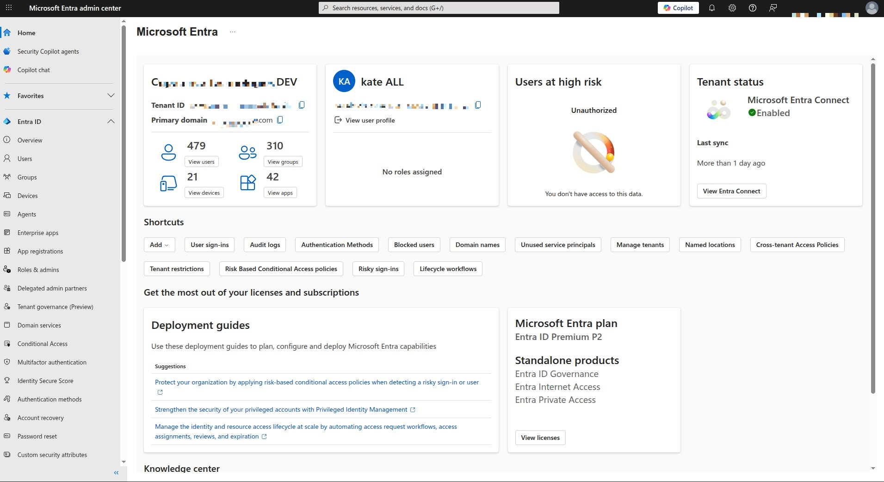

---

### Step 15 — Navigated to PIM as Test User

Still signed in as kate ALL, I navigated to **Privileged Identity Management > Quick start**. The PIM interface was now showing from the end-user perspective, with the same three options visible — the key difference being that kate ALL can only request activation, not manage assignments.

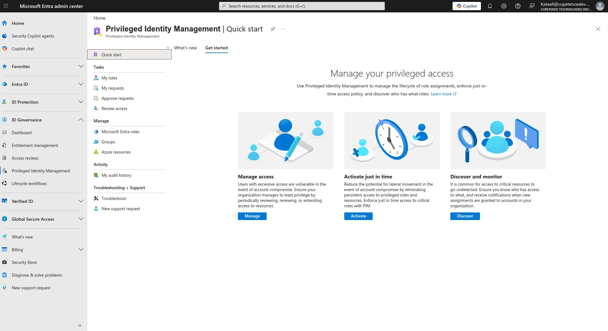

---

### Step 16 — Viewed Eligible Assignment in My Roles

I clicked **My roles > Microsoft Entra roles** and confirmed the **Eligible assignments** tab showed **Global Administrator** as an eligible role, with a scope of the tenant directory, end time of 8/23/2026, and an **Activate** button. This confirmed kate ALL could see her eligible assignment and was ready to request activation.

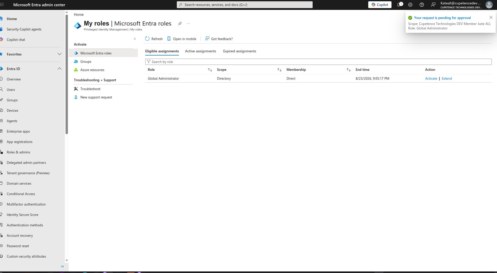

---

### Step 17 — Submitted Role Activation Request

I clicked **Activate** next to the Global Administrator role. The **Activate - Global Administrator** panel opened on the right. I configured:

| Setting | Value |
|---|---|
| Duration | **2 hours** |
| Reason | `Temporary admin access needed for user management testing` |

I clicked **Activate** to submit the request. Since approval was required, the request was sent to the configured approvers rather than activating immediately.

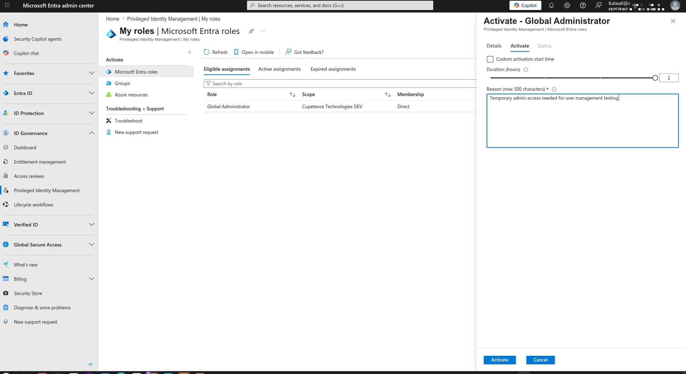

---

### Step 18 — Request Confirmed as Pending Approval

After submitting, the My roles page displayed a notification banner: **"Your request is pending for approval"** — Scope: @tenantname Member: kate ALL, Role: Global Administrator. This confirmed the request had been submitted and was awaiting approval from one of the 6 designated approvers.

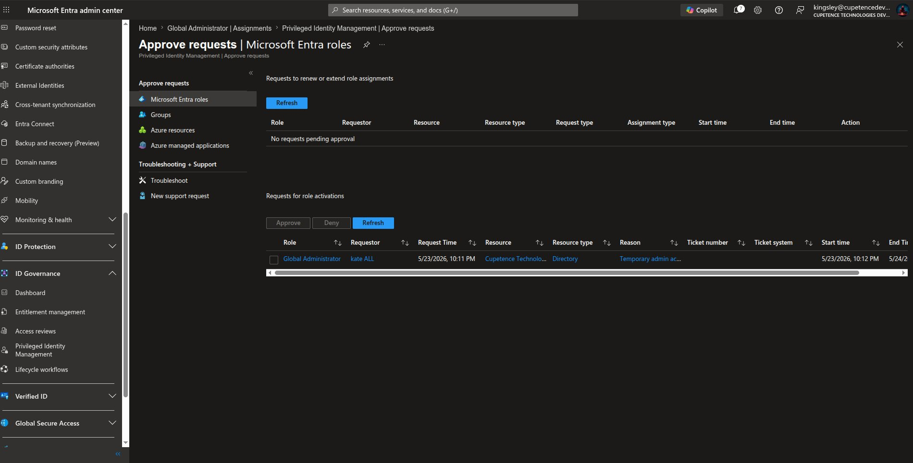

---

### Step 19 — Admin Received Email Notification to Approve

While kate ALL's request was pending, Microsoft Security automatically sent an email to the designated approver (Kingsley) in Outlook. The email — subject **"PIM: Review kate ALL's request to activate the Global Administrator role"** — contained full request details and an **Approve or deny request** button linking directly to the PIM portal:

| Field | Value |
|---|---|
| User | kate ALL |
| Resource type | Directory |
| Role name | Global Administrator |
| Reason | Temporary admin access required for Microsoft Entra administration testing |
| Start Time | 2026-05-24 02:11:46Z |

This is a critical enterprise control — approvers don't need to be monitoring the PIM portal; the system proactively notifies them the moment a request is submitted, enabling a fast and auditable approval response.

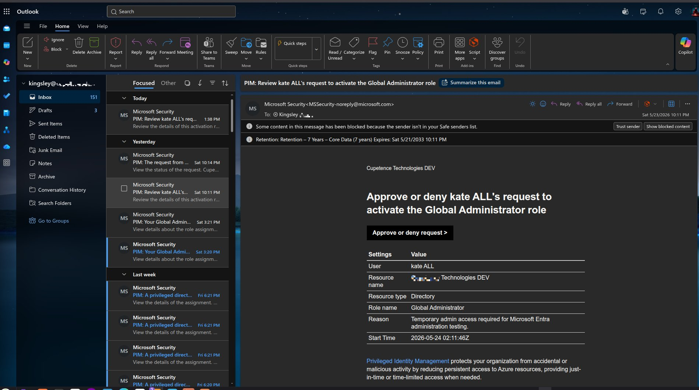

---

### Step 20 — Admin Received Approval Confirmation Email

After Kingsley approved the request in the portal, Microsoft Security automatically sent a second email confirming the outcome — subject **"PIM: The request from kate ALL to activate the Global Administrator role was approved"**. The email confirmed:

| Field | Value |
|---|---|
| Reviewed by | Kingsley |

This closure notification ensures the approver has a permanent record of the decision in their mailbox, supporting audit trail requirements and giving both the approver and requestor full visibility of the outcome without needing to revisit the portal.

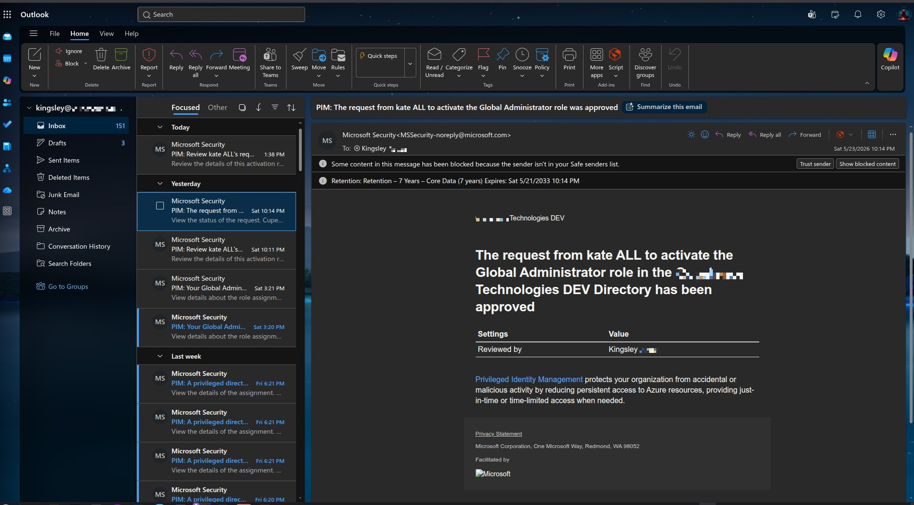

---

### Step 21 — Admin Viewed the Incoming Request

I switched back to the admin session (Kingsley). I navigated to **PIM > Approve requests > Microsoft Entra roles**. The **Requests for role activations** section showed kate ALL's pending request:

| Field | Value |
|---|---|
| Role | Global Administrator |
| Requestor | kate ALL |
| Request time | 5/23/2026, 10:11 PM |
| Reason | Temporary admin access... |

I checked the checkbox next to the request to select it for review.

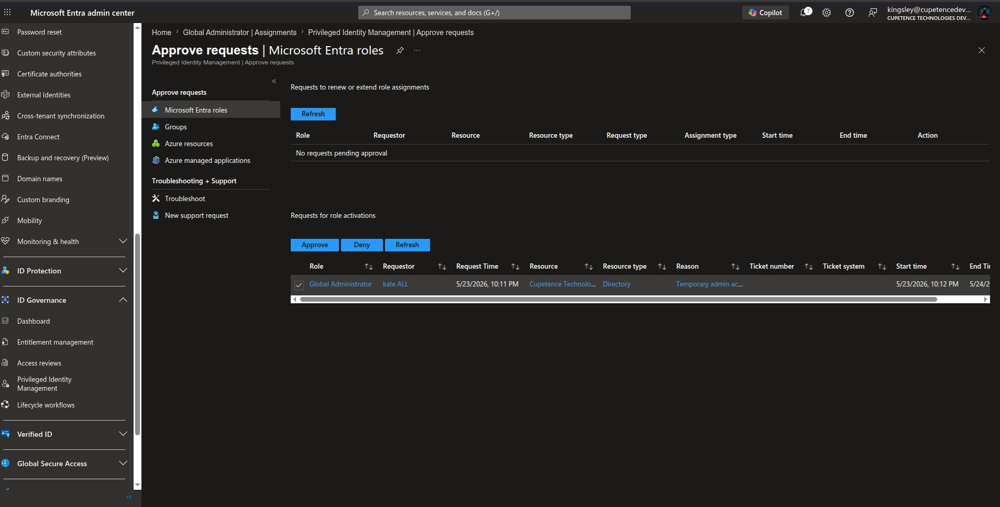

---

### Step 22 — Admin Reviewed and Approved the Request

The **Approve Request** panel opened on the right, showing full details of the request including the requestor's justification. I reviewed the request details and entered the approval justification:

> *"Approved temporary Global Administrator access for administrative testing."*

I clicked **Confirm** to approve the request.

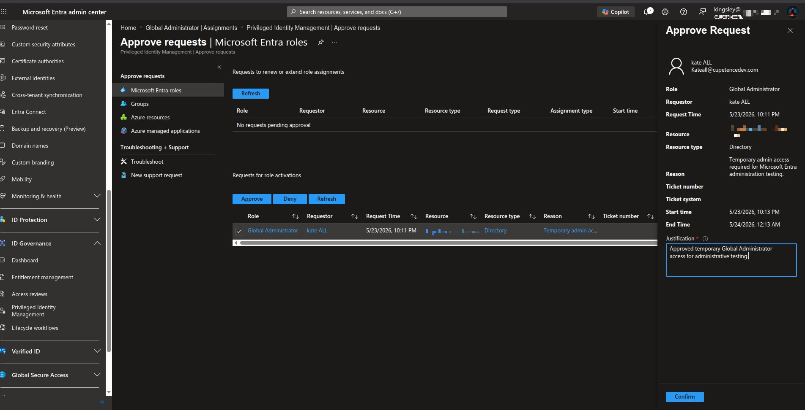

---

### Step 23 — ✅ Approval Confirmed

The approval was processed immediately. A green success banner appeared at the top right: **"Update request status — kate ALL is approved."** The Requests for role activations table cleared to "No requests pending approval," confirming the activation had been granted. Phase 4 was complete.

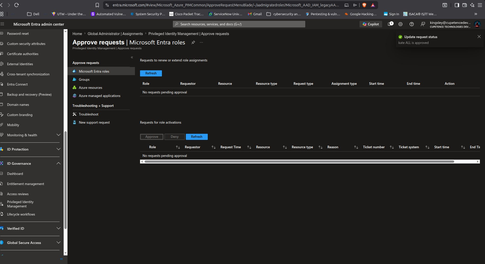

---

## Phase 5 — Verification & Audit

### Step 24 — ✅ Verified Role is Now Active for Test User

I switched back to the kate ALL browser session and refreshed the My roles page. Under **Active assignments**, the **Global Administrator** role now appeared with:

| Field | Value |
|---|---|
| Scope | @tenantname |
| Membership | Direct |
| State | **Activated** |
| End time | 5/24/2026, 12:14:36 AM |

This confirmed the JIT activation flow worked end-to-end — kate ALL now had temporary Global Administrator access that would automatically expire at 12:14 AM, a 2-hour window from activation.

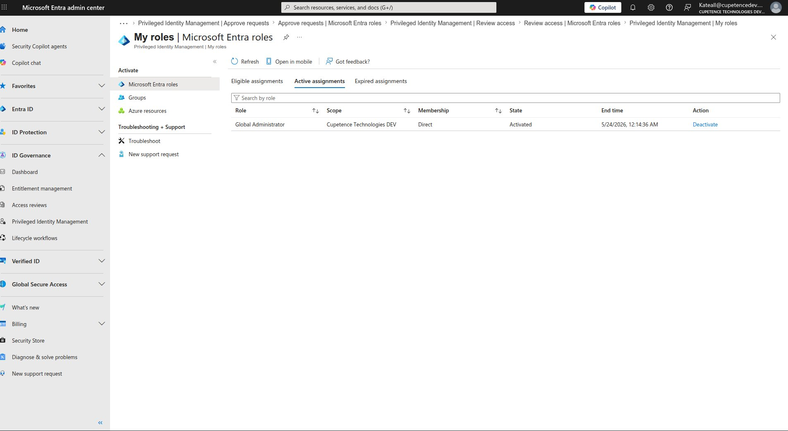

---

### Step 25 — Reviewed the Full PIM Audit History

I navigated to **PIM > My audit history** to review the complete activity log. The audit trail captured every action in chronological order, including:

- Role setting updates
- Eligible member added for kate ALL (time-bound)
- Member added to role request approved (PIM activation)
- Add member to role completed (PIM activation) by kate ALL

This audit trail provides full accountability and is critical for compliance reporting and security investigations.

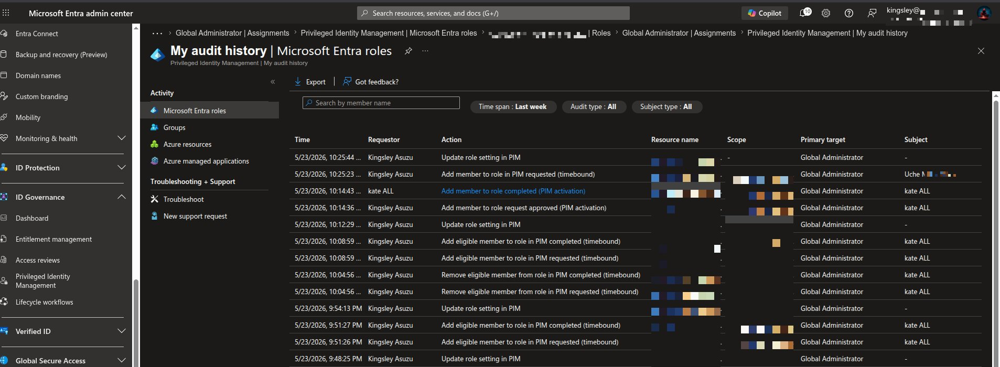

---

### Step 26 — Reviewed PIM Security Alerts

I navigated to **PIM > Alerts** to review the security alert dashboard. Four active alerts were displayed with their risk levels:

| Alert | Count | Risk |
|---|---|---|
| Roles don't require MFA for activation | 36 | 🟡 Medium |
| Eligible administrators aren't activating their privileged role | 4 | 🟢 Low |
| Roles are being assigned outside of PIM | 109 | 🔴 High |
| Potential stale accounts in a privileged role | 204 | 🟡 Medium |

The **High** alert showing 109 roles assigned outside of PIM indicated a significant governance gap in the tenant — roles being assigned via Entra ID directly rather than through PIM, bypassing all JIT controls. This is a key finding that would require remediation in a production environment.

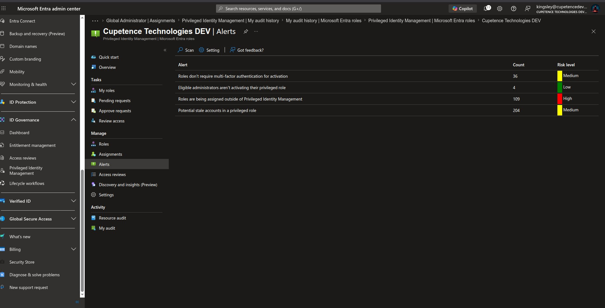

---

### Step 27 — Reviewed My Audit Log with Status

I navigated to **My audit** to view the complete audit log with status indicators for the last day. The log confirmed all PIM actions completed with green ✅ status, with one notable exception — a user named Uche had a scheduled eligible assignment showing ❌ (the time-bound request had not yet activated as it was set for a future date). All other operations — role setting updates, kate ALL's eligibility, activation request, approval, and alert activations — were confirmed as successful.

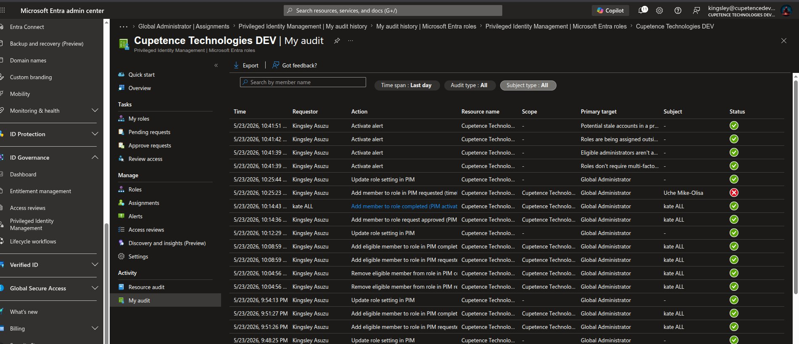

---

## Summary

In this lab, I successfully implemented a complete Just-In-Time access control framework using Microsoft Entra Privileged Identity Management:

| # | Achievement |
|---|---|
| ✅ 1 | Navigated the PIM interface and assessed the existing privileged role landscape |
| ✅ 2 | Configured Global Administrator activation settings — 2-hour max duration, Azure MFA required, justification required, approval workflow enabled with 6 designated approvers |
| ✅ 3 | Configured assignment expiry rules — 15-day eligible expiry, 6-month active expiry, no permanent assignments allowed |
| ✅ 4 | Configured PIM notification settings for assignment and activation events |
| ✅ 5 | Created time-bound eligible assignments for two test users — Uche (4-hour window) and kate ALL (3-month window) |
| ✅ 6 | Verified from the end-user perspective that eligible assignment alone grants no access — role must be explicitly requested |
| ✅ 7 | Submitted a JIT activation request as kate ALL with MFA, justification, and duration |
| ✅ 8 | Approved the activation request as admin with written justification |
| ✅ 9 | Confirmed Global Administrator role was active for kate ALL with a 2-hour expiry window |
| ✅ 10 | Reviewed full audit history and PIM security alerts, identifying a High-risk gap of 109 roles assigned outside PIM |

> 🔒 PIM is now enforcing Just-In-Time access for the Global Administrator role — no user holds standing admin privilege. All activations require MFA, justification, and admin approval, with automatic expiry ensuring least-privilege access at all times.

---

## 🧠 Skills Demonstrated

| Skill | Details |
|---|---|
| **Privileged Identity Management (PIM)** | End-to-end PIM configuration — navigation, role settings, assignment creation, activation, approval, and audit |
| **Just-In-Time (JIT) Access Control** | Replaced permanent admin assignments with time-bound eligible assignments requiring explicit activation |
| **Zero Trust Identity Principles** | Applied verify-explicitly and least-privilege principles by removing standing privilege from the Global Administrator role |
| **Approval Workflow Design** | Configured multi-approver workflows with MFA enforcement and justification requirements for privileged role activation |
| **Assignment Lifecycle Management** | Configured automatic expiry for both eligible and active assignments to prevent privilege accumulation |
| **PIM Notification & Alerting** | Configured role assignment and activation email notifications across assignees, requestors, and approvers |
| **Security Alert Interpretation** | Identified and interpreted 4 PIM security alerts including a High-risk finding of 109 roles assigned outside PIM |
| **Audit Log Analysis** | Reviewed PIM audit history to verify all actions, identify anomalies, and produce a compliance-ready activity trail |
| **End-User JIT Activation Flow** | Completed the full activation lifecycle from the end-user perspective — eligible role discovery, MFA, justification, pending approval, and confirmed activation |
| **Privileged Account Security** | Demonstrated understanding of standing privilege risk and how PIM mitigates it in an enterprise identity environment |

---

## 💼 Career Relevance

| Role | Relevance |
|---|---|
| **Cloud Security Engineer** | PIM is a core Zero Trust identity control — implementing JIT access for privileged roles is a standard responsibility in cloud security engineering |
| **Identity & Access Management (IAM) Analyst** | Managing privileged role assignments, approval workflows, and assignment lifecycles is central to IAM operations |
| **Microsoft 365 / Entra ID Administrator** | PIM configuration is one of the most advanced and valued skills for M365 and Entra ID admins — it requires Entra ID Premium P2 and deep platform knowledge |
| **Security Operations Center (SOC) Analyst** | PIM audit logs and security alerts are key sources for detecting privilege abuse, lateral movement, and insider threat activity |
| **IT Security Auditor / Compliance Analyst** | JIT access is a mandated control in **NIST 800-53 (AC-6)**, **ISO 27001 (A.9.2)**, **CIS Control 5**, and **Microsoft Security Benchmark** — demonstrating hands-on PIM skills directly supports audit and compliance roles |
| **Zero Trust Architect** | This lab implements the two most critical Zero Trust identity controls together: MFA enforcement (Conditional Access) and JIT privileged access (PIM) — the combination is the foundation of a mature Zero Trust posture |

> 🎯 PIM is consistently listed as a required or preferred skill in cloud security, IAM, and Microsoft 365 administrator job postings. Combined with the Conditional Access MFA lab, this portfolio demonstrates a complete Zero Trust identity security stack.

---

## 🔗 Related Labs in This Repository

| Lab | Description | Link |
|---|---|---|
| **Conditional Access — MFA Enforcement** | Configured a Conditional Access policy in Microsoft Entra ID requiring MFA for all users in a test group across all cloud applications | [View Lab](https://github.com/kingsrule50/conditional-access-mfa-lab) |
| **Azure SOC Homelab** | Practical cloud security labs built on Azure — deploying Active Directory, Splunk SIEM, and real detection rules from the ground up | [View Lab](https://github.com/kingsrule50/azure-soc-homelab) |
| **Windows Autopilot & Intune** | End-to-end Windows Autopilot deployment using Microsoft Intune and Entra ID — device enrollment, compliance policies, and zero-touch provisioning | [View Lab](https://github.com/kingsrule50/windows-autopilot-intune) |
| **Champulze M365 Project** | End-to-end Microsoft 365 tenant deployment — domain integration, Teams Premium, Exchange, SharePoint, user provisioning, and UAT validation | [View Lab](https://github.com/kingsrule50/Champulze_M365_Project_) |
| **Soulinspire M365 Teams Rollout** | Microsoft Teams rollout and governance project using Microsoft 365 cloud tools — policy configuration, channel governance, and user adoption | [View Lab](https://github.com/kingsrule50/soulinspire-m365-teams-rollout) |
| **Wireshark Threat Detection Lab** | Network threat detection lab simulating SYN scans and SMB enumeration in a segmented environment using Wireshark | [View Lab](https://github.com/kingsrule50/wireshark-threat-detection-lab) |

---

## 🛠️ Technologies Used

